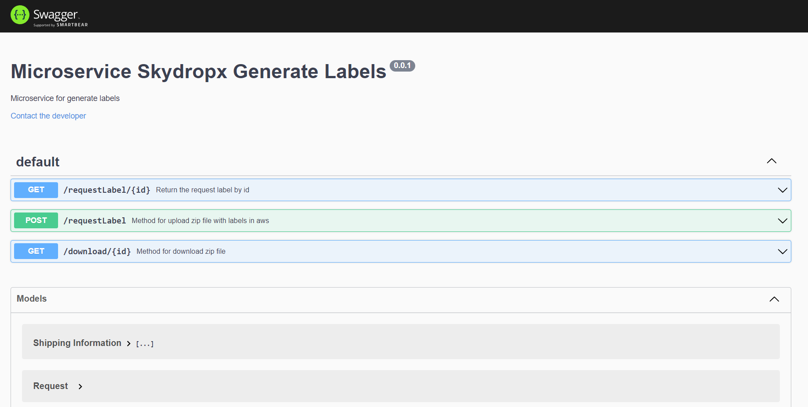

<div id="top"></div>


<!-- PROJECT LOGO -->
<br />
<div align="center">
  <a href="https://github.com/othneildrew/Best-README-Template">
    
  </a>

  <h3 align="center">API Request Labels</h3>

  <p align="center">
    An awesome Microservices request labels
  </p>
</div>


<!-- TABLE OF CONTENTS -->
<details>
  <summary>Table of Contents</summary>
  <ol>
    <li>
      <a href="#about-the-project">About The Project</a>
      <ul>
        <li><a href="#built-with">Built With</a></li>
      </ul>
    </li>
    <li>
      <a href="#getting-started">Getting Started</a>
      <ul>
        <li><a href="#installation">Installation</a></li>
      </ul>
    </li>
    <li><a href="#usage">Usage</a></li>
    <li><a href="#license">License</a></li>
    <li><a href="#contact">Contact</a></li>
  </ol>
</details>


<!-- ABOUT THE PROJECT -->
## About The Project

This is a microservice developed with hexagonal architecture which aims to generate travel labels, made for the company Skydropx, this process was divided into three parts to be handled in a simpler way.

The input for this microservice is an array with the specifications of where you want to send the package to where it goes, who sends and who receives with their respective information with this information.

1. An array of Buffers is generated that has the required Pdfs for the labels. 

2. From this information a packaging is generated in a Buffer of zip.

3. Finally this Buffer that packs the Pdfs is uploaded to S3 so that it can be downloaded at any time.

NOTE: these three steps are performed from a subprocess because this process needs to be asynchronous and could block the api, this is why a subprocess is launched to perform these 3 steps.


<p align="right">(<a href="#top">back to top</a>)</p>


### Built With

* [Node.js](https://nodejs.org/en/)
* [AWS](https://aws.amazon.com/es/)
* [Docker](https://www.docker.com/)
* [Jest](https://jestjs.io/)

<p align="right">(<a href="#top">back to top</a>)</p>


<!-- GETTING STARTED -->
## Getting Started

Follow the steps below for setting up the project

### Installation

_Below is an example of how you can install and setting up The app._

1. Clone the repo
   ```sh
   https://github.com/jeffleon/Skydropx
   ```
3. Install NPM packages
   ```sh
   npm install
   ```
4. Enter your enviroment variables `.env` see the `.env.sample`
   ```js
    database=sky_dropx
    user=root
    password=secret
    host=db
    accessKeyId=accesskeyexample
    secretAccessKey=secretkeyexample
    S3_Bucket=bucketexample
   ```
5. Run docker-compose up command
    ```
    docker compose up -d
    ```

<p align="right">(<a href="#top">back to top</a>)</p>


<!-- USAGE EXAMPLES -->
## Usage

If you have any issue or if you need something see the documentation of API in the endpoint http://localhost:8080/api-docs

<div align="center">
    
</div>

<p align="right">(<a href="#top">back to top</a>)</p>


<!-- LICENSE -->
## License

Distributed under the MIT License.

<p align="right">(<a href="#top">back to top</a>)</p>


<!-- CONTACT -->
## Contact

Jefferson Leon - jeffersonleon1527@gmail.com

Project Link: [https://github.com/jeffleon/Skydropx](https://github.com/jeffleon/Skydropx)

<p align="right">(<a href="#top">back to top</a>)</p>
